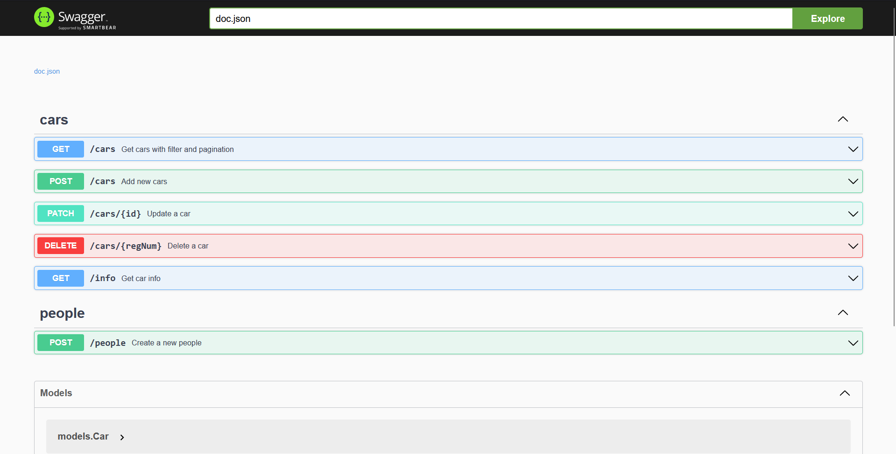

# Cars CRUD REST API

Cars API is a service written in Go. It provides endpoints for managing cars and people.

## Prerequisites

- Docker
- Docker Compose

## Configuration

The configuration of the application is done via environment variables. You can find an example configuration in the `.env.example` file. Copy this file to `.env` and adjust the variables to fit your needs.

```bash
cp .env.example .env
```

## Description of the environment variables:
- **HTTP_HOST**: The host the application should bind to.
- **HTTP_PORT**: The port the application should listen on.
- **DB_HOST**: The host of your PostgreSQL database.
- **DB_PORT**: The port of your PostgreSQL database.
- **DB_USER**: The user for your PostgreSQL database.
- **DB_PASSWORD**: The password for your PostgreSQL database.
- **DB_NAME**: The name of your PostgreSQL database.
- **DB_SSLMODE**: The SSL mode for your PostgreSQL database.
- **DEBUG**: Enable or disable debug mode.

## Running the application
```bash
docker compose up
```

## Swagger available on /swagger/index.html


## Possible improvements:
- Improve the logic for filtering cars.
- Add REST endpoints for what concerns the People model.
- Work on CI/CD and metrics collection.
